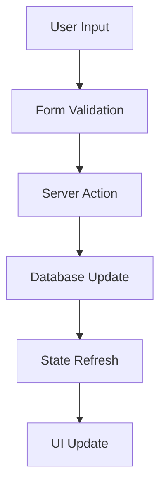
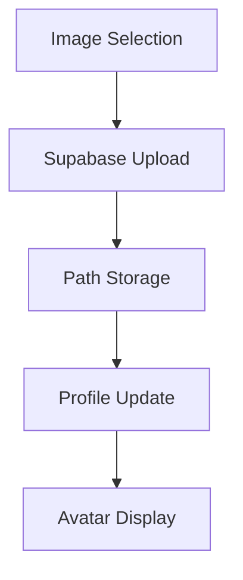

# Profile Page Architecture Overview

## Core Components Architecture

### 1. Server-Side Entry Point (`page.tsx`)
- **Primary Functions:**
  - Authentication verification
  - Profile data fetching via Prisma
  - Server action handling for profile updates
  - Initial data provision to client components

### 2. Component Structure
```
page.tsx
└── UserProfile.tsx
    └── UserProfileForm.tsx
        └── UserAvatar.tsx
```

### 3. Key Component Details

#### UserProfile.tsx (Container Component)
- **Role:** Layout orchestration
- **Responsibilities:**
  - Profile card structure
  - Form component integration
  - Props forwarding

#### UserProfileForm.tsx (Interactive Client Component)
- **Role:** User interaction handler
- **Features:**
  - Form field management
  - Avatar upload interface
  - State management with React hooks
  - Submit handling
  - User feedback system

#### UserAvatar.tsx (Display Component)
- **Role:** Avatar visualization
- **Features:**
  - Supabase storage integration
  - Fallback to user initials
  - Responsive image display

## Data Management

### 1. Schema Management (`profileSchema.ts`)
- Zod validation schema
- TypeScript type generation
- Data structure enforcement

### 2. State Management (`userStore.ts`)
```typescript
interface UserStore {
  user: User | null;
  profile: Profile | null;
  updateUser: (user: User) => void;
  updateProfile: (profile: Profile) => void;
}
```

### 3. Client Utilities (`client.ts`)
- Supabase client initialization
- Authentication helpers
- Storage access methods

## Data Flow Patterns

### 1. Profile Update Flow


### 2. Avatar Management Flow


## Implementation Notes

### Authentication Flow
1. Page load triggers auth check
2. Unauthenticated users redirect to login
3. Authenticated users proceed to profile fetch

### Data Validation Process
1. Client-side form validation
2. Server-side schema validation
3. Database constraint validation

### State Update Pattern
1. Form submission triggers server action
2. Database update executes
3. Global state refresh occurs
4. UI components rerender

## Error Handling

### Common Scenarios
- Invalid form data
- Failed avatar upload
- Database update errors
- Authentication failures

### Response Patterns
- User feedback messages
- Form state preservation
- Automatic retry logic
- Graceful fallbacks

## Best Practices

### Performance Optimization
- Lazy loading for avatar images
- Optimistic UI updates
- Debounced form submissions

### Security Measures
- Server-side validation
- Authentication checks
- File upload restrictions
- XSS prevention

### Maintainability
- Component isolation
- Type safety enforcement
- Clear state management
- Documented APIs

## Usage Examples

### Profile Update
```typescript
// Form submission handler
const handleSubmit = async (data: ProfileFormData) => {
  try {
    await updateProfile(data);
    showSuccessMessage();
  } catch (error) {
    handleError(error);
  }
};
```

### Avatar Upload
```typescript
// Avatar change handler
const handleAvatarChange = async (file: File) => {
  const path = await uploadToStorage(file);
  await updateProfile({ avatar_url: path });
};
```

## Testing Considerations

### Unit Tests
- Form validation
- Component rendering
- State updates

### Integration Tests
- Form submission flow
- Avatar upload process
- Authentication flow

### End-to-End Tests
- Complete profile update
- Error scenarios
- State persistence

## Deployment Considerations

### Environment Setup
- Supabase credentials
- Database access
- Storage configuration

### Performance Monitoring
- Form submission timing
- Image upload speed
- State update efficiency

This architecture provides a robust foundation for profile management while maintaining clear separation of concerns and type safety throughout the application.